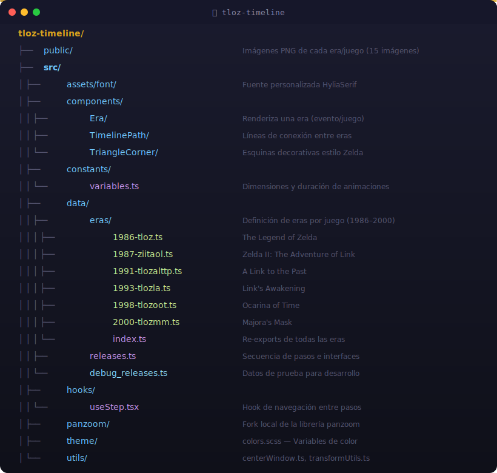
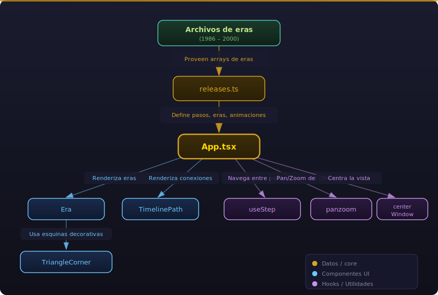

# 🗡️ TLoZ Timeline

Visualización interactiva de la línea temporal de **The Legend of Zelda**, construida con React y TypeScript. El usuario navega paso a paso por los juegos de la saga (desde 1986 hasta 2000), revelando nuevas eras y conexiones con animaciones secuenciales y transiciones de pan/zoom.

## Stack Tecnológico

| Tecnología | Uso |
|---|---|
| [React 18](https://react.dev/) | UI declarativa basada en componentes |
| [TypeScript](https://www.typescriptlang.org/) | Tipado estático |
| [Vite](https://vitejs.dev/) | Bundler y servidor de desarrollo |
| [anime.js](https://animejs.com/) | Animaciones de clip-path y movimiento |
| [SCSS Modules](https://sass-lang.com/) | Estilos modulares con alcance por componente |
| panzoom (fork local) | Pan & zoom sobre el canvas de la timeline |
| [gh-pages](https://www.npmjs.com/package/gh-pages) | Deploy a GitHub Pages |

## Estructura del Proyecto

<p align="center">
  
</p>

## Cómo Ejecutar

### Requisitos previos
- [Node.js](https://nodejs.org/) (v18+)
- [Yarn](https://yarnpkg.com/)

### Desarrollo local

```bash
# Instalar dependencias
yarn install

# Iniciar servidor de desarrollo (con HMR)
yarn dev
```

### Build de producción

```bash
# Compilar TypeScript y generar bundle
yarn build

# Previsualizar el build
yarn preview
```

### Deploy a GitHub Pages

```bash
yarn deploy
```

## Arquitectura

### Flujo de datos

<p align="center">
  
</p>

### Flujo de navegación

1. El usuario hace clic en el botón derecho (→) para avanzar al siguiente juego
2. `setScene()` verifica si el siguiente paso requiere:
   - **`makeSpace`**: Mover elementos existentes para hacer espacio (animado con anime.js)
   - **`centerWindow`**: Re-centrar y ajustar el zoom del canvas (animado con easing personalizado)
3. Se ejecutan las animaciones secuenciales de clip-path para revelar las nuevas eras y conexiones
4. El título inferior se actualiza con el nombre del juego y año

### Sistema de datos

Cada juego se define como un "release" en `releases.ts`:

- **`eras`**: Array de objetos `eraI` (tarjetas de juego/evento) y `connectionI` (líneas de conexión temporal)
- **`animations`**: Secuencia de animaciones de clip-path que revelan los elementos
- **`centerWindow`**: Si la vista debe re-centrarse al mostrar este paso
- **`makeSpace`**: Movimientos previos necesarios para hacer espacio a los nuevos elementos

Las eras se acumulan: cada función `getXXXX()` incluye las eras de los pasos anteriores usando spread (`...getPrevious()`), construyendo la timeline completa de forma incremental.

## Cómo Agregar un Nuevo Juego

1. **Crear el archivo de era** en `src/data/eras/` (ej. `2002-tloztww.ts`)
   - Importar la era anterior y extenderla con spread
   - Definir las nuevas eras (`eraI`) y conexiones (`connectionI`)
2. **Agregar la imagen** del juego en `public/` como PNG
3. **Exportar** la nueva función desde `src/data/eras/index.ts`
4. **Agregar el release** al array `releases` en `src/data/releases.ts` con sus animaciones y configuración de zoom
